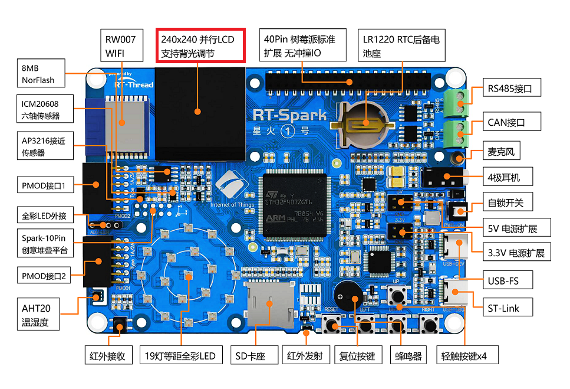

# 物流分拣系统

## 简介

本项目主要介绍了基于RTThread操作系统的物流分拣系统。

## 硬件说明

### 星火 1 号开发板

星火 1 号开发板板载的是一块 1.3 寸，分辨率为 240x240 的 LCD 显示屏，显示效果十分细腻。显示屏的驱动芯片是 ST7789 v3, 通信接口使用的是 8080 并口，通过 fsmc 模拟出驱动时序和单片机进行通讯。使用了 8 根数据线传输数据，一根地址选择线作为芯片的使能信号。



### Vision Board视觉开发板

Vision Board 是一款专为计算机视觉和机器视觉应用设计的开发板，集成了多种传感器和硬件接口，支持丰富的图像采集和处理功能。该视觉板配备高性能处理器，能够快速运行神经网络和图像算法，适合智能识别、自动驾驶辅助、机器人视觉等场景。 


### 15kg总线舵机

本项目采用了一款配备 15kg 扭矩级别的总线舵机的机械臂，具备较强的负载能力和精确的运动控制性能。所用总线舵机通过舵机控制板，采用串口通讯实现多关节联动控制，具有高精度位置反馈和可靠的抗干扰能力。


## 软件说明

本项目的主控板源码位于 `/rt_spark_project/applications/driver`。
视觉板源码位于 `/vision board检测模块.py`。

该软件是一个基于RT-Thread实时操作系统的嵌入式综合控制系统，通过多线程并行处理实现多项功能：首先启动WiFi连接线程建立网络通信；随后创建湿度监测线程实时采集并显示环境湿度数据；同时运行蜂鸣器控制线程处理声音提示；通过OpenMV视觉处理线程实现摄像头图像识别；LED矩阵线程负责状态信息显示；OneNET物联网线程实现云平台数据交互；机械臂控制线程执行精确动作指令；最后启动高响应优先级的按键扫描线程检测用户输入。系统采用模块化设计，为网络通信和机械控制分配更大内存资源（2048字节），关键功能添加200毫秒启动延时确保硬件初始化，整体构成一个集环境监测、机器视觉、物联网通信和执行机构控制于一体的智能硬件平台。

```c
int main(void)
{
    ......

    rt_thread_t wifi_thread = rt_thread_create("wifi",wifi_entry,RT_NULL,1024,20,20);
    if (wifi_thread != RT_NULL)
        rt_thread_startup(wifi_thread);
    rt_thread_mdelay(200);

    rt_thread_t humidity_thread = rt_thread_create("humidity",lcd_humidity_entry, RT_NULL,1024,20, 20);
    if (humidity_thread != RT_NULL)
        rt_thread_startup(humidity_thread);

    rt_thread_t buzzer_thread = rt_thread_create("buzzer",buzzer_entry, RT_NULL,1024,20, 20);
    if (buzzer_thread != RT_NULL)
        rt_thread_startup(buzzer_thread);

    rt_thread_t openmv_thread = rt_thread_create("uart_openmv", openmv_uart_entry, RT_NULL, 1024, 20, 10);
    if (openmv_thread != RT_NULL)
        rt_thread_startup(openmv_thread);

    rt_thread_t led_matrix_thread = rt_thread_create("led_matrix", led_matrix_entry, RT_NULL, 1024, 20, 20);
    if (led_matrix_thread != RT_NULL)
        rt_thread_startup(led_matrix_thread);
    rt_thread_mdelay(200);

    rt_thread_t onenet_thread = rt_thread_create("onenet", onenet_entry, RT_NULL, 2048, 20, 20);
    if (onenet_thread != RT_NULL)
        rt_thread_startup(onenet_thread);
    rt_thread_mdelay(200);

    rt_thread_t robotic_arm_thread = rt_thread_create("robotic_arm", robotic_arm_entry, RT_NULL, 2048, 20, 20);
    if (robotic_arm_thread != RT_NULL)
        rt_thread_startup(robotic_arm_thread);
    rt_thread_mdelay(200);

    rt_thread_t key_scan_thread = rt_thread_create("key_scan",key_scan,RT_NULL,1024,20,1);
    if (key_scan_thread != RT_NULL)
        rt_thread_startup(key_scan_thread);
    rt_thread_mdelay(200);


    return 0;
}
```

## 运行

### 编译 & 下载

- RT-Thread Studio：在 RT-Thread Studio 的包管理器中下载 `STM32F407-RT-SPARK` 资源包，然后创建新工程，执行编译。
- MDK：首先双击 mklinks.bat，生成 rt-thread 与 libraries 文件夹链接；再使用 Env 生成 MDK5 工程；最后双击 project.uvprojx 打开 MDK5 工程，执行编译。

编译完成后，将开发板的 ST-Link USB 口与 PC 机连接，然后将固件下载至开发板。

### 运行效果

按下复位按键重启开发板，正常运行后，LCD 上会显示当前温湿度，同时自动连接wifi，wifi状态有板上led灯提供，绿灯为连接成功，红灯为断开连接。


## 引用参考

暂无。
